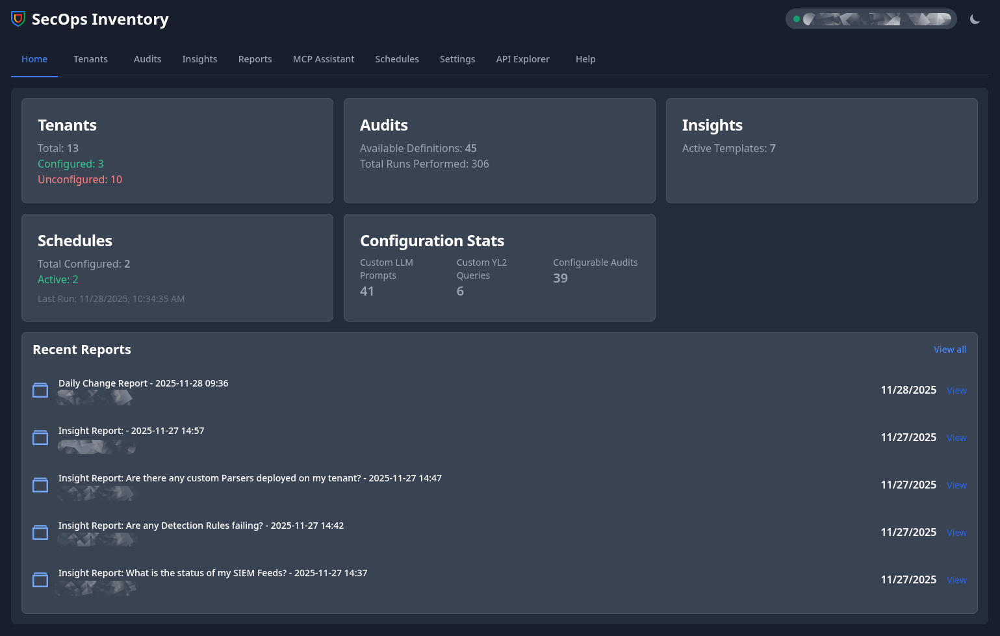

# SecOps Inventory & Intelligence Platform

The **SecOps Inventory & Intelligence Platform** is a web-based application designed to streamline the management, auditing, and analysis of multi-platform SecOps environments, including **Google SecOps (Chronicle)**, **SecOps SOAR**, and **BindPlane**.

The platform provides a centralized inventory, a dynamic and extensible audit engine, a powerful AI-driven reporting system using **Gemini 2.5 Pro**, and an interactive AI assistant to help security professionals transform raw configuration data into actionable intelligence.




## Features

*   **Centralized Inventory**: Single-pane-of-glass view for all managed tenants.
*   **Setup Wizard**: GUI-driven wizard for easy initial configuration and tenant onboarding.
*   **Dynamic Audit Engine**: Configurable audit engine capable of targeting any API (Chronicle, SOAR, etc.).
*   **AI-Powered Reporting**: Generates human-readable summaries and insights from raw audit data using Gemini models.
*   **Diff Reports**: Automatically highlights configuration drift between audit runs.
*   **MCP Assistant**: Conversational AI assistant to query application data using natural language.
*   **Automation**: Scheduled audits and reports via Celery and Redis.
*   **Dashboard**: Real-time overview of system status, reports, and key metrics.

## Prerequisites

*   **Python 3.10+**
*   **Node.js & npm** (for building Tailwind CSS)
*   **Redis Server** (for background task processing)
*   **Google Gemini API Key**

## Installation

1.  **Clone the repository:**
    ```bash
    git clone https://github.com/yourusername/secops_inventory.git
    cd secops_inventory
    ```

2.  **Set up Python Environment:**
    ```bash
    python3 -m venv venv
    source venv/bin/activate
    pip install -r requirements.txt
    ```

3.  **Install Node.js dependencies:**
    ```bash
    npm install
    ```

4.  **Configure the Application:**
    Copy the example configuration file and edit it if necessary (though most configuration is done via the UI).
    ```bash
    cp config.ini.example config.ini
    ```

    **Environment Variables:**
    You need to set the `GEMINI_API_KEY` for the AI features to work.
    ```bash
    export GEMINI_API_KEY="your-gemini-api-key"
    ```

## Running the Application

The application consists of three components that need to run simultaneously: the Web Server, the Celery Worker, and the Celery Beat scheduler.

### 1. Build CSS (Tailwind)
Start the Tailwind watcher to compile CSS changes:
```bash
npm run tailwind:build
```

### 2. Start Redis
Ensure your Redis server is running:
```bash
redis-server
```

### 3. Start the Web Server (FastAPI)
```bash
fastapi dev main.py
```
The application will be available at `http://127.0.0.1:8000`.

### 4. Start Celery Worker
Handles background tasks like audits and report generation.
```bash
celery -A celery_worker.celery_app worker --loglevel=info
```

### 5. Start Celery Beat
Handles scheduled tasks.
```bash
celery -A celery_worker.celery_app beat --loglevel=info
```

## Contributing

1.  Fork the repository.
2.  Create a new feature branch (`git checkout -b feature/amazing-feature`).
3.  Commit your changes (`git commit -m 'Add some amazing feature'`).
4.  Push to the branch (`git push origin feature/amazing-feature`).
5.  Open a Pull Request.

## License

This project is licensed under the Apache License 2.0 - see the [LICENSE](LICENSE) file for details.
