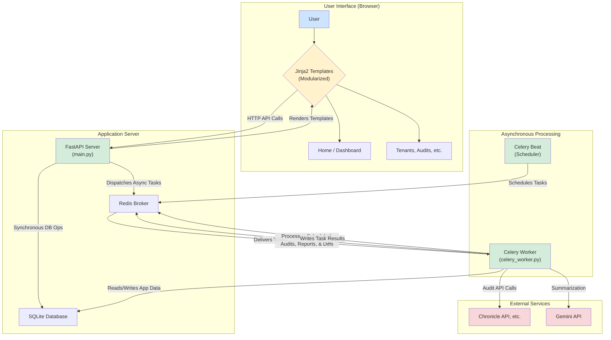

# SecOps Inventory Application Architecture

This document provides a high-level overview of the application's architecture using a Mermaid flow diagram.

## Architectural Diagram

---

## Explanation of the Flow

1.  **User Interaction**: The user interacts with the web interface in their browser. This interface is now dynamically rendered by the FastAPI server using **Jinja2 Templates** (modularized into `tabs/` and `modals/`), providing a cleaner development structure.

2.  **API Calls**: When the user performs an action (e.g., running an audit, saving a schedule, generating a report, or **loading the dashboard**), the JavaScript frontend makes an HTTP API call to the **FastAPI Server** (`main.py`).

3.  **Synchronous vs. Asynchronous Operations**: The FastAPI server distinguishes between two types of operations:
    *   **Synchronous (Fast Operations)**: For quick actions like fetching configurations, listing reports, or saving settings, the FastAPI server interacts directly with the **SQLite Database** and returns a response to the user immediately.
    *   **Asynchronous (Long-Running Operations)**: For tasks that could take a significant amount of time (like running audits, generating AI summaries, or purging old data), FastAPI dispatches a task to the **Celery Worker** via the **Redis Broker**. It then immediately returns a `task_id` to the frontend, preventing the user's browser from waiting or timing out.

4.  **Asynchronous Task Processing**: The Celery Worker (`celery_worker.py`), running as a separate process, continuously monitors the Redis Broker for new tasks. When a task is received, the worker executes it. This often involves making API calls to External Services like the Chronicle API (for audits) or the Gemini API (for report summarization or diff analysis). During its work, the Celery worker reads and writes data directly to the SQLite Database (e.g., saving new audit results, generated reports, or diff reports). The worker stores its progress and the final result of the task back into Redis. The frontend can then poll a status endpoint to check on the task's progress using the `task_id` it received earlier.

5.  **Scheduled Tasks**: A third process, Celery Beat, acts as the application's scheduler. Based on its configuration, Celery Beat wakes up at regular intervals (in this case, every minute) and triggers the `schedule_ticker` task. This tells the Celery Worker to check the database for any scheduled jobs that are due to run, effectively automating the audit, reporting, and **diff reporting** processes.
